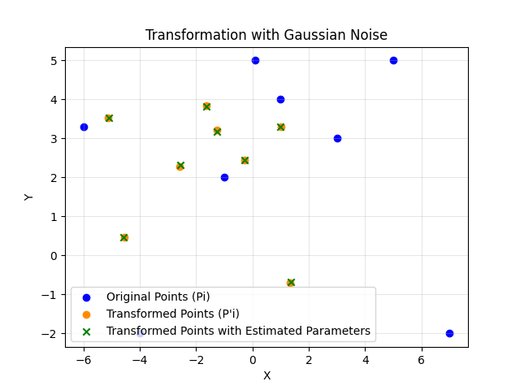

# Transformation of Correlated Point Pairs

## Transformation matrix

$$
\begin{bmatrix}
x' \\
y'
\end{bmatrix}
 = s
\begin{bmatrix}
cos(rot) & -sin(rot) \\
sin(rot) & cos(rot)
\end{bmatrix}
\begin{bmatrix}
x \\
y
\end{bmatrix} + 
\begin{bmatrix}
Tx \\
Ty
\end{bmatrix}
$$

where:
- x, y are the coordinates of the original point.
- x', y' are the coordinates of the transformed point.
- s is the scale factor.
- rot is the rotation angle.
- Tx, Ty are the translation factors

## Equation System
The solution is based on the **least squares method**, which minimizes the error in transformation estimation. 
\
Transformation equations:
$$
x' = s * (x * cos(rot) - y * sin(rot)) + Tx 
$$
$$
y' = s * (x * sin(rot) + y * cos(rot)) + Ty
$$
Rewriting this system in matrix form:

$$
\begin{bmatrix}
1 & 0 & x & -y \\
0 & 1 & y & x
\end{bmatrix}
\begin{bmatrix}
T_x \\
T_y \\
s \cos(rot) \\
s \sin(rot)
\end{bmatrix}
=
\begin{bmatrix}
x' \\
y'
\end{bmatrix}
$$

For all given points, we construct a large matrix **A** and a vector **B** with the target coordinates:

$$
A \cdot X = B
$$

where:
- A is a 16 * 4  matrix containing coefficients.
- X is the unknown vector.
- B is the vector of target coordinates.

## Solving the Equation System

To determine the unknowns, we apply the **least squares solution**:

$$
(A^T  A)  X = A^T  B
$$
$$
X = (A^T A)^{-1} A^T B
$$

where:
- $A^T A$ forms a square matrix from the system of equations.
- $A^T B$ is the product of the transposed coefficient matrix with the target values.
- **NumPy’s `np.linalg.solve`** function is used to solve for **X**.

---

## Getting Transformation Parameters

The transformation parameters can now be extracted:

- **Translation**:

  $
  T_x = X[0], \quad T_y = X[1]
  $

- **Rotation and Scaling**:

  $
  s = \sqrt{X[2]^2 + X[3]^2}
  $

  $
  rot = \arctan2(X[3], X[2])
  $

---

## Applying the Transformation to the Original Points

The estimated transformation is applied to the original points using:

$
P'_{estimated} = s \cdot R \cdot P + T
$

## Results


```
Optimal Translation (Tx, Ty): -2.214478209721399, 1.1295107298557607
Optimal Scale (s): 0.5489201849268759
Optimal Rotation (rot): -10.874065066973527 degrees (-0.18978823849478577 radians)
Calculated noise: 0.014124866165613441
Mean error: 0.0282

Transformation Matrix:
[[ 0.53906389  0.10355431 -2.21447821]
 [-0.10355431  0.53906389  1.12951073]
 [ 0.          0.          1.        ]]
```
